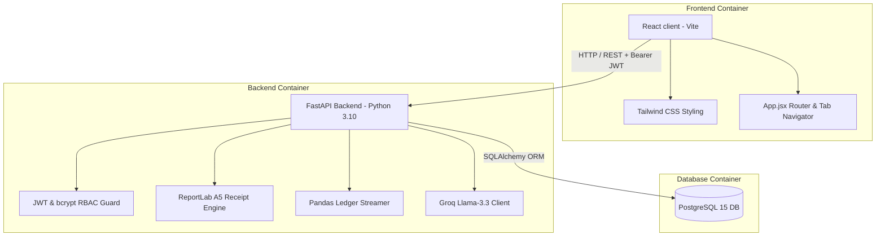
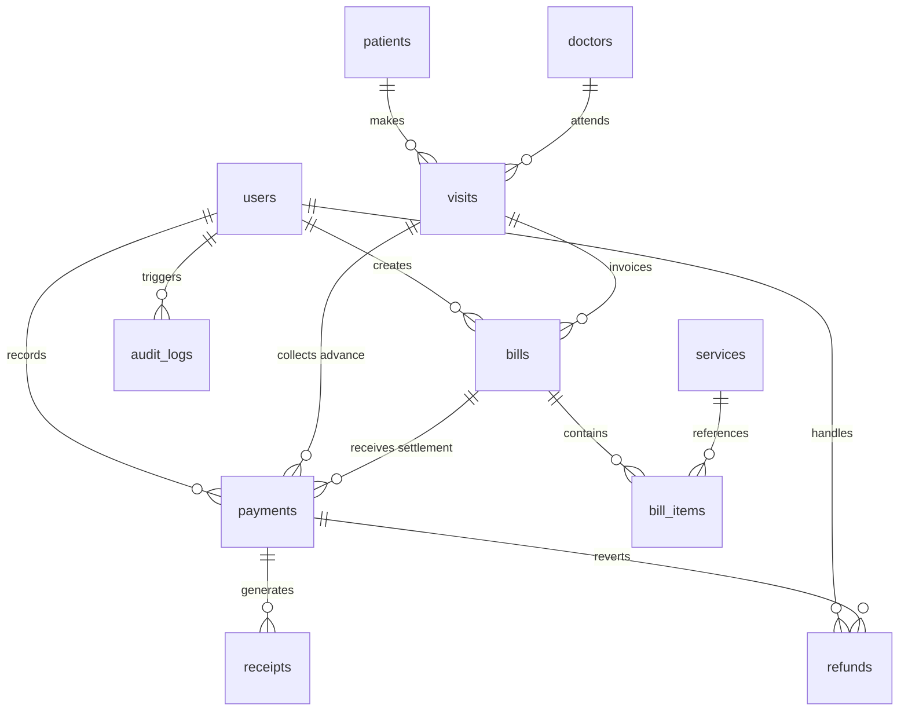

# HospiSynAI - Hospital Payment, Billing, and Patient Consultation Assistant

**🔗 Live Demo**: [https://hospi-syn-ai.vercel.app/](https://hospi-syn-ai.vercel.app/)  
**🔗 API Documentation (Swagger)**: [https://hospisynai.onrender.com/docs](https://hospisynai.onrender.com/docs)

HospiSynAI is a production-grade, real-time hospital billing, receptionist desk, payment audit, and patient consultation ecosystem. Designed with SDE-3 guidelines, it features a clean React + Tailwind CSS client, a high-performance Python FastAPI backend, and a robust PostgreSQL relational database layer.

The entire stack is containerized and orchestrates seamlessly with a single command via Docker Compose.


---

## 🌟 Key Features

### 🏢 Core Hospital Workflows
- **Patient Desk**: Patient profiles registration and search (lookup by Patient ID, Name, Mobile, Receipt ID, or Bill ID).
- **Consultation & Visit Logger**: Logs sequential patient visits under a visit index (`Patient ➔ Visit ➔ Invoice`).
- **Standardized Services Catalog**: Dynamic catalog grouping doctor consultations, OPD, IPD, ICU, labs, radiology, and pharmacy charges with standard base pricing. Editable via the Admin panel.
- **Invoice Builder (Billing Queue)**: Interactive multi-item billing builder allowing receptionist staff to override standard catalog pricing, group multiple services, auto-fetch and adjust visit-level advance payments, and calculate balances.

### 🧠 Advanced AI-Powered Assistant Ecosystem
- **AI Consultation Summary & Patient Handout**: Converts doctor's raw clinical notes (diagnosis, complaints, medicines, advice, follow-up) into a structured daily-routine narrative with emojis (Morning, Afternoon, Night) in both English and Hindi.
- **AI Clinical Treatment & Prescription Suggester**: Generates clinical recommendations (diagnoses, medicines, diagnostic tests, advice, follow-up schedules) based on patient complaints, age, and gender, following strict Indian clinical prescribing and safety rules (e.g. BD/OD dosing constraints, pediatric vs geriatric modifications, and non-overlapping classes).
- **AI Service & Diagnostic Test Recommender**: Recommends the most relevant OPD services or tests directly from the hospital's active services catalog based on patient demographics and symptoms, providing clinical justifications.
- **AI Billing Auditor & Anomaly Checker**: Audits bill items prior to invoice creation to identify financial and clinical anomalies, classifying status as `clear`, `warning`, or `critical` (checks for duplicate tests, clinically unlikely service combinations like ICU + OPD, excessive amounts, missing consultation fees, or age-inappropriate billing).
- **AI Dashboard Revenue Insights**: Performs real-time server-side analytics on today's transaction ledgers, digital/cash splits, and outstanding dues to produce data-driven business insights, actionable administrative suggestions, highlights, and revenue sentiments (positive, neutral, negative).

### 💳 Payments & Receipts Desk
- **Multi-Method Collection**: Support for `Cash`, `UPI`, `Card`, `Net Banking`, and `Wallet` transactions with reference tracking (transaction IDs).
- **Payment Types**: Supports `Advance`, `Partial`, `Full` (Final Settlement), and `Refund` payment flows.
- **ReportLab Dynamic PDF Receipt Engine**: Strictly mimics standard diagnostic slip templates (reproducing "Vedam Diagnostics" / "Dr. Shweta Grover" headers).
- **Customizable Templates**: Hospital branding, addresses, contacts, GSTIN, doctor details, and header layouts are stored in a `settings` table and editable in real-time from the Admin settings panel without code rebuilds.
- **Refund Desk**: Allows accountants or admins to issue refunds against specific transaction references, automatically adjusting the parent invoice balance and writing refund receipts.

### 📊 Administrative Controls
- **Advanced KPI Dashboard**: Aggregated counters for total registered patients, today's patient visits, total revenue, outstanding dues, cash/online collection splits, and refund aggregates with interactive charts.
- **Pandas Data Exporting**: Direct server-side streaming responses of transaction ledgers to Excel (`.xlsx`) and CSV formats using `pandas` and `openpyxl`.
- **System Audit Log**: Automatic immutable action logger tracking credentials logins, patient registrations, billing edits, payments, settings shifts, and refunds.
- **RBAC Security**: Role-Based Access Control enforcing specific views and actions:
  - **Receptionist**: Registration, visits, deposits, and bill creation.
  - **Accountant**: Billing queues, payment processing, refunds, downloads, and receipts.
  - **Admin**: All views, audit log table, catalog standard pricing, user management, and branding settings.

---

## 🏗️ Project Architecture

HospiSynAI is built as a decoupled, multi-container system that orchestrates a frontend client, a REST API server, and a relational database.



### File Structure
```
HospiSynAI/
├── docker-compose.yml          # Multicontainer orchestration
├── backend/
│   ├── Dockerfile              # Backend package compilation
│   ├── requirements.txt        # Backend python dependencies
│   ├── database.py             # Connection pooling configurations
│   ├── models.py               # SQLAlchemy schemas & soft-delete relations
│   ├── schemas.py              # Pydantic validation boundaries
│   ├── auth.py                 # JWT, Bcrypt & RBAC logic
│   ├── pdf_generator.py        # ReportLab customizable layout PDF engine
│   └── main.py                 # FastAPI endpoints, exports, seeder & audits
└── frontend/
    ├── Dockerfile              # Vite React development build
    ├── package.json            # React modules (lucide, recharts)
    ├── vite.config.js          # Port 3000 mapping
    ├── tailwind.config.js      # Teal/Charcoal typography styling
    ├── index.html              # Custom fonts bootloader
    └── src/
        ├── index.css           # Global directives & printable media configurations
        ├── main.jsx            # DOM bootstrapping
        ├── App.jsx             # Main dashboard container & router
        └── components/         # Dashboard modular feature tabs
            ├── DashboardTab.jsx      # KPI charts & revenue statistics
            ├── PatientSearchTab.jsx  # Patient lookup, visits, & AI summary
            ├── BillingTab.jsx        # Invoicing, collections, & refunds
            ├── CatalogTab.jsx        # Medical services & standard pricing
            ├── SettingsTab.jsx       # Branding & dynamically printed PDF settings
            ├── UsersTab.jsx          # User accounts management (RBAC)
            └── AuditLogsTab.jsx      # Chronological system activity logger
```

---

## ⚡ Quick Start (Single Command)

### Prerequisites
- Install [Docker Desktop](https://www.docker.com/products/docker-desktop/) (includes Docker Compose).

### Launch the Stack
Clone or navigate to the project directory and execute:

```bash
docker-compose up --build
```

Docker will automatically pull Postgres 15, compile the FastAPI image, pull React node modules, initialize tables, seed base data, and run the services:

- **Frontend Application**: [http://localhost:3000](http://localhost:3000) (with volume-mounted hot-reloading enabled)
- **FastAPI Documentation (Swagger UI)**: [http://localhost:5000/docs](http://localhost:5000/docs)
- **PostgreSQL Database**: Exposing port `5432`

---

## 🔑 Default Accounts (Development Only)

On first startup, the database is automatically seeded with three accounts representing different staff roles:

| Username | Password | Role | Panel Permissions |
| :--- | :--- | :--- | :--- |
| **admin** | `admin123` | **Admin** | Complete system access. Audit logs, user administration, catalog editing, and hospital branding configurations. |
| **receptionist** | `recep123` | **Receptionist** | Front Desk operations. Patient finder/registration, logging visits, receiving advance deposits, and billing creator. |
| **accountant** | `acct123` | **Accountant** | Financial desk. Invoice queue payment processing, receipts preview/printing, refund processing, dashboard reports, and CSV/Excel downloads. |

> [!WARNING]
> These credentials are seeded for development and evaluation purposes. For production deployments, change these passwords immediately.

### Security & Role-Based Access Control (RBAC)

The backend implements JWT token-based authentication and role-based checks using FastAPI dependency injections (specifically `auth.RoleChecker`).

| Feature / Workspace | Admin | Accountant | Receptionist | Implementation Details |
| :--- | :---: | :---: | :---: | :--- |
| **User Management** | ✅ | ❌ | ❌ | Restricted by `RoleChecker(["Admin"])` |
| **Hospital Branding Settings** | ✅ | ❌ | ❌ | Restricted by `RoleChecker(["Admin"])` |
| **Audit Logs** | ✅ | ❌ | ❌ | Restricted by `RoleChecker(["Admin"])` |
| **Catalog Price Adjustments** | ✅ | ❌ | ❌ | Restricted by `RoleChecker(["Admin"])` |
| **Soft Delete Patients/Bills** | ✅ | ❌ | ❌ | Restricted by `RoleChecker(["Admin"])` |
| **Financial KPI Dashboard** | ✅ | ✅ | ❌ | Restricted by `RoleChecker(["Admin", "Accountant"])` |
| **Spreadsheet Exports (Excel/CSV)** | ✅ | ✅ | ❌ | Restricted by `RoleChecker(["Admin", "Accountant"])` |
| **Invoice Settlements & Refunds** | ✅ | ✅ | ❌ | Restricted by `RoleChecker(["Admin", "Accountant"])` |
| **Patient Registration & Visits** | ✅ | ❌ | ✅ | Restricted by `RoleChecker(["Admin", "Receptionist"])` |
| **Billing Builder (Bill Queue)** | ✅ | ❌ | ✅ | Restricted by `RoleChecker(["Admin", "Receptionist"])` |

---

## 🛠️ Relational Database Schema Design

The PostgreSQL database is fully normalized and handles cascading deletions, soft-delete statuses, dynamic branding parameters, and audit trails.

### Entity Relationship Diagram (ERD)



### Table Schema Definitions

1. `users`: Stores staff authentication credentials (hashed using bcrypt) and role configurations.
2. `patients`: Core profile table (`patient_id` matches format `PAT-YYYYMMDD-XXXXX`). Contains `is_active` soft-delete index.
3. `doctors`: Stores medical practitioners' information (name, qualifications).
4. `visits`: Index tracking patient entries (`visit_id` formatted `VIS-YYYYMMDD-XXXXX`). Contains symptoms, diagnosis, and prescription details.
5. `services`: Price book representing standard hospital rates (OPD registration, ICU bed rent, MRIs, etc.).
6. `bills`: Financial invoice records (`bill_id` formatted `BILL-YYYYMMDD-XXXXX`) detailing total billed amounts, applied visit advances, remaining outstanding balances, and payment statuses (`Pending`, `Partial Paid`, `Paid`).
7. `bill_items`: Individual invoice lines referencing standard service IDs, capturing price snapshot at billing.
8. `payments`: Logs transactions (`payment_id` formatted `PAY-YYYYMMDD-XXXXX`). Links to visit for advance deposits or bill for invoice payments. Stores method (Cash, UPI, etc.), reference notes, and type.
9. `receipts`: Connects completed payments to customized template paths and generated PDFs (`receipt_id` formatted `REC-YYYYMMDD-XXXXX`).
10. `refunds`: Outflow tracking table (`refund_id` formatted `REF-YYYYMMDD-XXXXX`) mapping adjustments back to the original transaction.
11. `settings`: Key-value configuration dictionary storing logo headers, doctor names, addresses, contacts, and tax info.
12. `audit_logs`: Chronological log entries mapping actions to user sessions.

---

## 📊 Verification Flow Walkthrough

Follow this standard workflow to verify system capabilities:

### Step 1: Front Desk (Receptionist)
1. Log in to [http://localhost:3000](http://localhost:3000) using `receptionist` / `recep123`.
2. Navigate to **Patient Search & Desk**.
3. Fill out the **New Registration** form to register a new patient profile. Check that a unique sequential Patient ID is generated (e.g. `PAT-20260626-00001`).
4. Select the registered patient. Fill out the **Record Patient Visit** input to start a consultation (e.g., inputting "Fever and Dry Cough" as symptoms). Check that a Visit ID is generated.
5. Click the **Clinical Notes & AI Summary** button on the active visit to open the consultation workspace modal:
   - In the chief complaints field, write or select symptoms (e.g., "Fever and Dry Cough").
   - Click the **🧠 AI Suggest Treatment** button. The system will leverage Groq LLM to instantly generate standard clinical prescriptions (diagnosis, medicines with dosages, diagnostic tests, advice, follow-up schedule) compliant with clinical dosing rules.
   - Review and customize the AI-suggested fields as needed.
   - Click **Generate AI Summary** to trigger the Groq LLM API. Verify that a simplified, bilingual (English + Hindi) explanation is populated showing structured routines.
   - Click **Save Summary** to store it, and **Print Summary** or **Download PDF** to retrieve the ReportLab-generated prescription sheet.
6. In the visit module, record an **Advance Deposit** of `500` via `UPI` (Reference: `TXN987654`).
7. Build an invoice using the **Multi-Item Bill Creator**:
   - To find appropriate tests for the patient's symptoms, click **✨ AI Test Suggester**. The system queries the active services database catalog and returns recommendations with reasons based on the patient's age, gender, and symptoms.
   - Click **Add to Bill** to select a recommended test (e.g. Complete Blood Count (CBC) - standard ₹350, and Chest X-Ray PA View - standard ₹450).
   - Before generating the invoice, click **Run AI Audit** under the **AI Billing Auditor** section. The audit scans line items for duplicates, excessive charges, missing consultation codes, clinical mismatches, or age anomalies, returning a `clear`, `warning`, or `critical` verdict.
   - Click **Generate Invoice** after verifying the audit.
8. Check that the system automatically applies the `500` advance payment to the `800` grand total, setting the bill status to `Partial Paid` with a remaining balance of `300`.

### Step 2: Financial Desk (Accountant)
1. Log in as `accountant` / `acct123`.
2. Verify the **AI Dashboard Revenue Insights** card displayed at the top of the Dashboard. It dynamically parses today's financials (revenue, visits, online/cash splits, outstanding dues) to present an administrative summary, data highlight, actionable recommendation, and sentiment color indicator.
3. Go to **Billing Queue**. Locate the outstanding invoice generated in the previous step.
4. Click **Pay**, choose `UPI`, and enter `300` as the collection amount.
5. Click **Process Payment**. Check that the invoice status immediately shifts to `Paid` and a receipt modal opens.
6. In the receipt modal:
   - Click **Save PDF** to download the high-quality ReportLab PDF generated by the backend.
   - Click **Print Receipt** to verify formatting.
7. Issue a refund: Copy the **full Payment ID** (starts with `PAY-`) directly from the Patient Desk (which displays full Payment IDs with a one-click copy button next to receipts), the Receipt modal, or the Billing Workspace's transaction log. Paste it into the **Refund Desk** on the right, input a refund amount (e.g., `100` for test cancellation), and click **Issue Refund Receipt**. Check that the invoice balance returns to `100` and a Refund Receipt is logged.
8. Run spreadsheet reports by clicking **CSV Report** or **Excel Report** at the top of the dashboard.

### Step 3: Administration (Admin)
1. Log in as `admin` / `admin123`.
2. Go to **Hospital Settings**. Edit the branding fields (e.g. change the Doctor Name or Hospital Logo/Title).
3. Open any receipt. Check that the printed/displayed PDF headers update dynamically.
4. Check the **System Audit Trail** tab. Verify that all patient registrations, visit additions, payments, settings modifications, and user logins are logged with their corresponding timestamp and user session.

---

## 🔒 Security & Configuration / Deployment Notes

For deployment and local setup, the project supports a `.env` configuration file. A `.env.example` has been provided at the project root to guide configuration.

### ⚙️ Environment Variables Reference

| Variable Name | Description | Default Value |
| :--- | :--- | :--- |
| `POSTGRES_DB` | PostgreSQL database name | `hospisyn` |
| `POSTGRES_USER` | PostgreSQL admin username | `postgres` |
| `POSTGRES_PASSWORD` | PostgreSQL admin password | `postgrespassword` |
| `POSTGRES_PORT` | Port exposed by PostgreSQL container | `5432` |
| `DATABASE_URL` | SQLAlchemy connection string | `postgresql://postgres:postgrespassword@db:5432/hospisyn` |
| `JWT_SECRET` | Secret key for signing authorization tokens | `supersecretgooglesde3hospitalbillingsystemkey12345` |
| `JWT_ALGORITHM` | Algorithm used for JWT signatures | `HS256` |
| `ACCESS_TOKEN_EXPIRE_MINUTES`| Expiration lifetime of access tokens | `480` |
| `BACKEND_PORT` | Port mapped to FastAPI backend | `5000` |
| `FRONTEND_PORT` | Port mapped to React frontend | `3000` |
| `VITE_API_BASE_URL` | API Base URL used by the React client | `http://localhost:5000/api` |
| `VITE_STATIC_BASE_URL` | Static download Base URL (for PDF receipts) | `http://localhost:5000` |
| `GROQ_API_KEY` | API Key for Groq Cloud services (required for AI features) | *(None)* |
| `GROQ_MODEL` | Groq LLM model to use for generating summaries | `llama-3.3-70b-versatile` |

### 🚀 Production Deployment Checklist

1. **Passwords**: Change the default credentials seeded by `backend/main.py`.
2. **Secrets**: Generate a secure, cryptographically random string for `JWT_SECRET` in your `.env` file.
3. **Exposed Ports**: Customize `BACKEND_PORT` and `FRONTEND_PORT` if there are conflicts on the host system.
4. **SSL/TLS & Domain**: Update `VITE_API_BASE_URL` and `VITE_STATIC_BASE_URL` to your production domain (using `https`) and host backend/frontend behind an Nginx reverse proxy.
5. **Backup Plan**: Create automated cron jobs to backup the `pgdata` volume (PostgreSQL state) and `receipts_data` volume (generated receipt files).

