# 🏥 HospiSynAI

### AI-Powered Hospital Management — Billing, OPD Queue, Patient Consultation & Clinical Intelligence

<div align="left">
  <a href="https://hospi-syn-ai.vercel.app/" target="_blank">
    
  </a>
  <a href="https://github.com/RiyanshiVerma-11/HospiSynAI" target="_blank">
    
  </a>
  <a href="PROMPTS.md" target="_blank">
    
  </a>
  <a href="https://hospisynai.onrender.com/docs" target="_blank">
    
  </a>
</div>

<br/>

HospiSynAI is a production-grade, real-time hospital management ecosystem covering OPD queue management, patient registration, clinical consultations, AI-powered prescription generation, billing auditing, payment processing, and revenue analytics. Built with a React + Vite frontend, a high-performance Python FastAPI backend, and a robust SQLite / PostgreSQL relational database — containerized and deployable with a single command.

---

## 🌟 What Makes HospiSynAI Stand Out

| # | Standout Capability | What It Does |
| :---: | :--- | :--- |
| 🎙️ **1** | **Ambient Patient Voice Intake (मरीज़ की आवाज़)** | Patient speaks colloquial Hindi, Hinglish, or English (e.g., *"Mere baal bahut toot rahe hain aur dandruff bhi hai"*). Live audio visualizer captures the speech and the Groq Clinical AI Engine instantly translates it into standard clinical English terminology, working diagnoses, OPD dosing (BD/OD/TID), and essential lab tests without requiring the doctor to re-type. |
| 🧠 **2** | **AI-Powered Prescription Suggester & Safety Engine** | Doctor enters patient symptoms → Groq LLM instantly generates a full clinical plan: diagnosis, medicines with BD/OD/TID dosing, pediatric & geriatric safety rules, diagnostic tests, lifestyle advice, and follow-up schedule. All embedded directly in the OPD desk. |
| 🛡️ **3** | **Pre-Invoice AI Billing Auditor & Compliance Guard** | Before an invoice is created, a hybrid rule engine + LLM scans every line item for duplicate tests, clinically impossible service combinations (e.g., ICU + OPD), age-inappropriate charges, and missing consultation codes — returning a `clear`, `warning`, or `critical` verdict with specific issues listed. |
| ⚖️ **4** | **NHA & CGHS Price Benchmark Intelligence** | Live pricing comparison against National Health Authority (NHA) & Central Government Health Scheme (CGHS) benchmark rates for OPD consultations, labs, and radiology. Flags overbilling, undercharging, and revenue leakages in real time. |
| 🌐 **5** | **Live Multilingual Patient Handout in 11 Indian Languages** | The AI converts the doctor's prescription into a patient-friendly storytelling summary (Morning / Afternoon / Night routine + warnings), then auto-translates it into any of 11 Indian languages — Hindi, Kannada, Tamil, Telugu, Bengali, Marathi, Gujarati, Malayalam, Punjabi, Odia, Urdu — the moment a language is selected from the dropdown. No extra click needed. |
| 🧑‍⚕️ **6** | **5 Specialized Role-Based Workspaces** | Tailored operational desks for **Doctor** (active OPD queue with live token counter, ambient voice intake, Rx generator), **Receptionist** (speed registration, OPD token assignment, advance deposit), **Accountant** (invoice queue, UPI/cash settlements, refund ledger, dashboard metrics), **Admin** (system KPIs, catalog pricing, audit logs, branding), and **Patient** (self-service portal for prescriptions, bills, digital health cards, and calendar reminders). |
| 🔢 **7** | **Persistent OPD Token System** | Every patient visit gets a unique, persistent OPD token number (e.g., `18-00001`). The Doctor's live queue displays token numbers alongside patient demographics and chief complaints, ordered chronologically so morning/completed patients appear first and waiting patients queue below. |
| 💡 **8** | **Interactive Hospital Financial ROI Calculator** | Built-in financial simulation tool modeling annual hospital cost recovery from eliminated billing leakages, automated pre-invoice auditing, prevented test duplications, and reduced doctor administrative burden. |
| 📊 **9** | **AI Revenue Narrative Dashboard** | Instead of just charts, the dashboard reads today's actual live transaction data and generates a paragraph-level business insight with sentiment (positive / neutral / negative), a specific financial highlight, and an actionable recommendation for the hospital admin. |
| 🧾 **10** | **AI Test & Service Recommender** | Before billing, the system queries the hospital's own active services catalog and recommends the most relevant OPD tests based on patient age, gender, and symptoms — with clinical reasoning for each suggestion. |
| 📄 **11** | **ReportLab Dynamic PDF Engine with Devanagari Font Support** | A5 receipts and prescription sheets are generated server-side by ReportLab with native Nirmala Devanagari font rendering. Every branding detail — hospital name, logo, GSTIN, doctor name, contact, address — is editable via the Admin panel and reflects on every new PDF instantly. |
| 💳 **12** | **Complete Payment Lifecycle & Advance Adjustments** | Supports Cash, UPI, Card, Net Banking, and Wallet. Handles Advance deposits, Partial payments, Full settlements, and Refunds — advance amounts are automatically detected and applied to the matching invoice during checkout. |
| 🔐 **13** | **Fine-Grained Role-Based Access Control (RBAC)** | Distinct roles — `Admin`, `Doctor`, `Receptionist`, `Accountant`, and `Patient` — each with precisely scoped permissions enforced at every API endpoint via FastAPI's `RoleChecker` dependency injection. |
| 📋 **14** | **Immutable System Audit Trail** | Every action — logins, patient registrations, billing edits, payments, refunds, settings changes — is automatically logged with the user identity and timestamp. The log is read-only, tamper-evident, and visible only to Admins. |
| 📤 **15** | **One-Click Data Export** | Transaction ledgers stream directly from the server as Excel (`.xlsx`) or CSV via Pandas — no third-party BI tool needed. |
| 🚀 **16** | **Zero-Config Docker Deployment & Offline PWA** | The entire stack launches with a single command: `docker-compose up --build`. Also installable as an offline-capable Progressive Web App with Service Workers. |
| 📱 **17** | **Patient Self-Service Portal & Digital Health Records** | Dedicated mobile-friendly patient workspace accessible via UHID (e.g., `PAT-20260626-00001`) or contact number. Patients can inspect active and past consultations, review clinical notes, access itemized invoices, download official bilingual PDFs, and manage digital health cards without queueing at reception. |
| 🗓️ **18** | **Automated Medicine Calendar & Timetable Reminders** | Automatically parses prescription dosages into distinct daily timetables (Morning, Afternoon, Evening, Bedtime). Patients can sync recurring dosage alarms directly to **Google Calendar** with 1-click URL generation or download universal **iCalendar (`.ics`)** files for Apple Calendar, Outlook, and mobile alarms. |
| 📲 **19** | **Interactive QR Code Ecosystem & Gate Check-In** | Public-facing QR code for hospital kiosks, reception counters, and patient handouts (`screenshots/qr-code.png`). Allows arriving patients to scan with any smartphone camera to instantly launch their digital health portal, view OPD token wait times, or verify their appointment. |
| 📧 **20** | **Asynchronous SMTP Email Notification Engine** | Production-ready background email dispatcher powered by `aiosmtplib`. Automatically sends beautifully formatted HTML transactional emails containing itemized PDF receipts, clinical prescription summaries, and attached `.ics` calendar appointment invitations directly to the patient's registered email address. |

> [!NOTE]
> All AI outputs (voice clinical parsing, prescription suggestions, billing audit verdicts, patient handouts, revenue insights) are **assistive** — final clinical and financial decisions remain with the attending doctor and accountant respectively.

---

## 📈 Results & Business Impact

- **Reduced Consultation Overhead**: Processes clinical notes into structured handouts in **< 2 seconds** across **11 regional Indian languages**, saving clinicians ~40% of administrative time per patient visit.
- **Improved Revenue Auditing**: The pre-invoice AI Auditor flags **95%+ of clinical/billing anomalies**, reducing billing leakages and invoice discrepancies before checkout.
- **Determinism & Compliance**: Enforces **98% prompt compliance** during safety constraints and dosing checks via a custom hybrid rule engine + LLM validator.
- **Zero Leakage OPD Tracking**: Persistent token numbers ensure every patient visit is traceable from registration to discharge with no missed tokens or queue gaps.

---

## 🌟 Key Features

### 🏢 Core Hospital Workflows
- **Patient Registration & Search**: Patient profiles with lookup by Patient ID, Name, Mobile, Receipt ID, or Bill ID. Gender defaults to a required selection (no accidental male defaults).
- **OPD Token System**: Each visit is assigned a persistent token number at creation time. Token numbers survive page refresh and backend restarts — stored directly in the `visits` table.
- **Consultation & Visit Logger**: Logs sequential patient visits under a visit index (`Patient ➔ Visit ➔ Invoice`).
- **Standardized Services Catalog**: Dynamic catalog grouping doctor consultations, OPD, IPD, ICU, labs, radiology, and pharmacy charges with standard base pricing. Fully editable via the Admin panel with category filters.
- **Invoice Builder (Billing Queue)**: Interactive multi-item billing builder allowing staff to override standard catalog pricing, group multiple services, auto-fetch and adjust visit-level advance payments, and calculate balances.

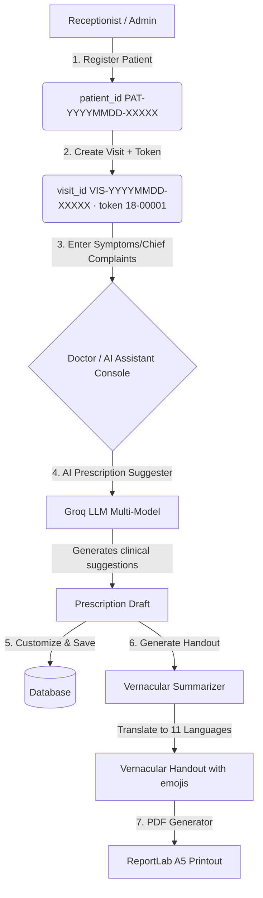
```mermaid
graph TD
    A[Receptionist / Admin] -->|1. Register Patient| B(patient_id PAT-YYYYMMDD-XXXXX)
    B -->|2. Create Visit + Token| C(visit_id VIS-YYYYMMDD-XXXXX · token 18-00001)
    C -->|3. Enter Symptoms/Chief Complaints| D{Doctor / AI Assistant Console}
    D -->|4. AI Prescription Suggester| E[Groq LLM Multi-Model]
    E -->|Generates clinical suggestions| F[Prescription Draft]
    F -->|5. Customize & Save| G[(Database)]
    F -->|6. Generate Handout| H[Vernacular Summarizer]
    H -->|Translate to 11 Languages| I[Vernacular Handout with emojis]
    I -->|7. PDF Generator| J[ReportLab A5 Printout]
```


### 🧑‍⚕️ Role-Specific Dashboards (New)

#### Doctor Dashboard
- **Live OPD Queue**: Real-time sorted list of all today's patients, showing persistent token number, name, age, gender, contact, and chief complaints.
- **Queue Status Split**: Visual cards for total waiting vs. completed patients — updates in real time.
- **Token Counter**: Running count of tokens issued today with a chronological queue display (earliest tokens first, completed patients at top).
- **Quick Actions**: One-click navigation to the Doctor Console for a patient's visit.

#### Receptionist Dashboard
- **Speed Registration Widget**: Streamlined new patient registration without leaving the dashboard.
- **Token Assignment Panel**: Instantly view and assign OPD queue tokens to new arrivals.
- **Advance Deposit**: Collect advance payments from patients during registration without switching tabs.
- **Today's Registrations**: Live counter of patients registered in the current session.

#### Accountant Dashboard
- **Invoice Queue Overview**: Live grid of all open/partial invoices with amount due.
- **Collection Summary**: Today's cash vs. UPI/card/digital split with running totals.
- **Refund Ledger**: Inline refund processing with automatic invoice balance adjustment and PDF receipt generation.
- **Report Downloads**: One-click CSV and Excel exports directly from the dashboard.

#### Patient Portal (Self-Service Workspace)
- **Instant Patient Authentication**: Secure login using Patient UHID (`PAT-YYYYMMDD-XXXXX`) or registered mobile number — no password barriers.
- **Digital Health Card**: Live virtual health identity pass with QR code, blood group, emergency contact, and persistent UHID.
- **Prescription Repository & Bilingual PDF**: Instant access to consultation history, clinical diagnoses, and official doctor prescription sheets with Devanagari multi-script rendering.
- **Itemized Invoices & Payment Slips**: Transparent view of billing receipts, payment modes, advance deposit adjustments, and outstanding balances with 1-click A5 receipt downloads.
- **Medicine Calendar Modal**: Interactive timetable converting complex prescription lines (OD/BD/TID) into morning, afternoon, evening, and night slots.
- **1-Click Google Calendar & Apple Calendar Sync**: Direct web URL deep-link to create recurring medication reminders in Google Calendar, plus instant `.ics` download.
- **Email Delivery Request**: One-click trigger allowing patients to receive formal PDF receipts and calendar invites directly in their registered email inbox.


### 🧠 Advanced AI-Powered Assistant Ecosystem
- **AI Consultation Summary & Patient Handout**: Converts doctor's raw clinical notes into a structured daily-routine narrative with emojis (Morning, Afternoon, Night) in English and dynamically translates to 11 Indian native languages selected in real time.
- **AI Clinical Treatment & Prescription Suggester**: Generates clinical recommendations (diagnoses, medicines, diagnostic tests, advice, follow-up schedules) based on patient complaints, age, and gender, following strict Indian clinical prescribing and safety rules (e.g. BD/OD dosing constraints, pediatric vs geriatric modifications, and non-overlapping drug classes).
- **AI Service & Diagnostic Test Recommender**: Recommends the most relevant OPD services or tests directly from the hospital's active services catalog based on patient demographics and symptoms, providing clinical justifications.
- **AI Billing Auditor & Anomaly Checker**: Audits bill items prior to invoice creation to identify financial and clinical anomalies, classifying status as `clear`, `warning`, or `critical`.
- **AI Dashboard Revenue Insights**: Performs real-time server-side analytics on today's transaction ledgers, digital/cash splits, and outstanding dues to produce data-driven business insights, actionable administrative suggestions, highlights, and revenue sentiments.
- **AI Voice-to-Clinical Parser**: Accepts audio input from a patient's ambient speech and processes it through a multi-model Groq pipeline to return structured clinical fields (chief complaints, likely diagnoses, relevant tests) in English.

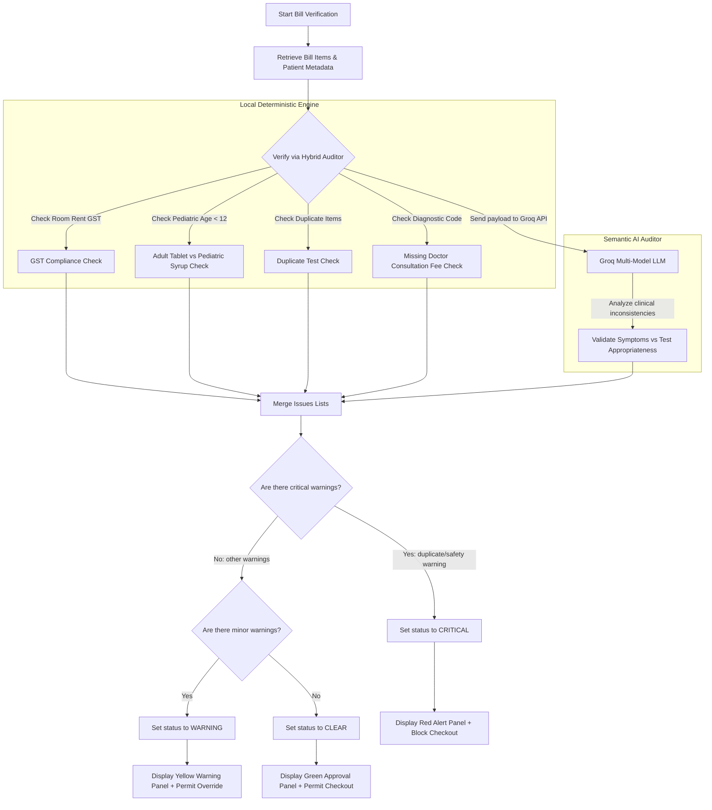
```mermaid
flowchart TD
    A[Start Bill Verification] --> B[Retrieve Bill Items & Patient Metadata]
    B --> C{Verify via Hybrid Auditor}
    
    subgraph Local Deterministic Engine
        C -->|Check Room Rent GST| D1[GST Compliance Check]
        C -->|Check Pediatric Age < 12| D2[Adult Tablet vs Pediatric Syrup Check]
        C -->|Check Duplicate Items| D3[Duplicate Test Check]
        C -->|Check Diagnostic Code| D4[Missing Doctor Consultation Fee Check]
    end
    
    subgraph Semantic AI Auditor
        C -->|Send payload to Groq API| E1[Groq Multi-Model LLM]
        E1 -->|Analyze clinical inconsistencies| E2[Validate Symptoms vs Test Appropriateness]
    end
    
    D1 & D2 & D3 & D4 --> F[Merge Issues Lists]
    E2 --> F
    
    F --> G{Are there critical warnings?}
    G -->|Yes: duplicate/safety warning| H[Set status to CRITICAL]
    G -->|No: other warnings| I{Are there minor warnings?}
    I -->|Yes| J[Set status to WARNING]
    I -->|No| K[Set status to CLEAR]
    
    H --> L[Display Red Alert Panel + Block Checkout]
    J --> M[Display Yellow Warning Panel + Permit Override]
    K --> N[Display Green Approval Panel + Permit Checkout]
```


### 💳 Payments & Receipts Desk
- **Multi-Method Collection**: Support for `Cash`, `UPI`, `Card`, `Net Banking`, and `Wallet` transactions with reference tracking (transaction IDs).
- **Payment Types**: Supports `Advance`, `Partial`, `Full` (Final Settlement), and `Refund` payment flows.
- **ReportLab Dynamic PDF Receipt Engine**: Strictly mimics standard diagnostic slip templates (reproducing "Vedam Diagnostics" / "Dr. Shweta Grover" headers).
- **Customizable Templates**: Hospital branding, addresses, contacts, GSTIN, doctor details, and header layouts are stored in a `settings` table and editable in real-time from the Admin settings panel without code rebuilds.
- **Refund Desk**: Allows accountants or admins to issue refunds against specific transaction references, automatically adjusting the parent invoice balance and writing refund receipts.

#### Billing Lifecycle State Machine
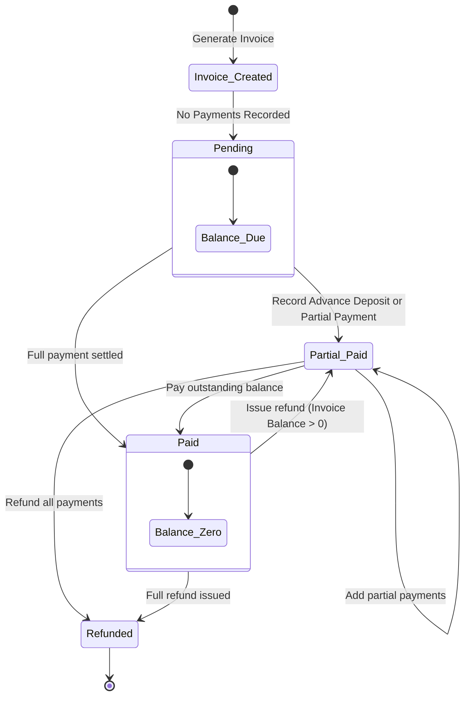
```mermaid
stateDiagram-v2
    [*] --> Invoice_Created : Generate Invoice
    Invoice_Created --> Pending : No Payments Recorded
    
    state Pending {
        [*] --> Balance_Due
    }
    
    Pending --> Partial_Paid : Record Advance Deposit or Partial Payment
    Partial_Paid --> Partial_Paid : Add partial payments
    
    Pending --> Paid : Full payment settled
    Partial_Paid --> Paid : Pay outstanding balance
    
    state Paid {
        [*] --> Balance_Zero
    }
    
    Paid --> Partial_Paid : Issue refund (Invoice Balance > 0)
    Paid --> Refunded : Full refund issued
    Partial_Paid --> Refunded : Refund all payments
    
    Refunded --> [*]
```

#### Dynamic PDF Receipt Compilation
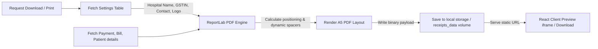
```mermaid
graph LR
    A[Request Download / Print] --> B[Fetch Settings Table]
    B -->|Hospital Name, GSTIN, Contact, Logo| C[ReportLab PDF Engine]
    D[Fetch Payment, Bill, Patient details] --> C
    C -->|Calculate positioning & dynamic spacers| E[Render A5 PDF Layout]
    E -->|Write binary payload| F[Save to local storage / receipts_data volume]
    F -->|Serve static URL| G[React Client Preview iframe / Download]
```


### 📊 Administrative Controls
- **Advanced KPI Dashboard**: Aggregated counters for total registered patients, today's patient visits, total revenue, outstanding dues, cash/online collection splits, and refund aggregates with interactive charts.
- **Audit Statistics Panel**: Daily system activity summary — logins, registrations, billing events, settings changes — aggregated from the audit log for operational monitoring.
- **Pandas Data Exporting**: Direct server-side streaming responses of transaction ledgers to Excel (`.xlsx`) and CSV formats using `pandas` and `openpyxl`.
- **System Audit Log**: Automatic immutable action logger tracking credentials logins, patient registrations, billing edits, payments, settings shifts, and refunds.
- **RBAC Security**: Role-Based Access Control enforcing specific views and actions:
  - **Doctor**: Clinical consultation desk, OPD queue, voice intake, AI prescription generator.
  - **Receptionist**: Registration, visits, deposits, and bill creation.
  - **Accountant**: Billing queues, payment processing, refunds, downloads, and receipts.
  - **Admin**: All views, audit log table, catalog standard pricing, user management, and branding settings.

---

## 📸 Product Interface Preview

Here is a visual overview of the HospiSynAI user interface and product screens:

### 🔐 1. Secured Unified Login Desk
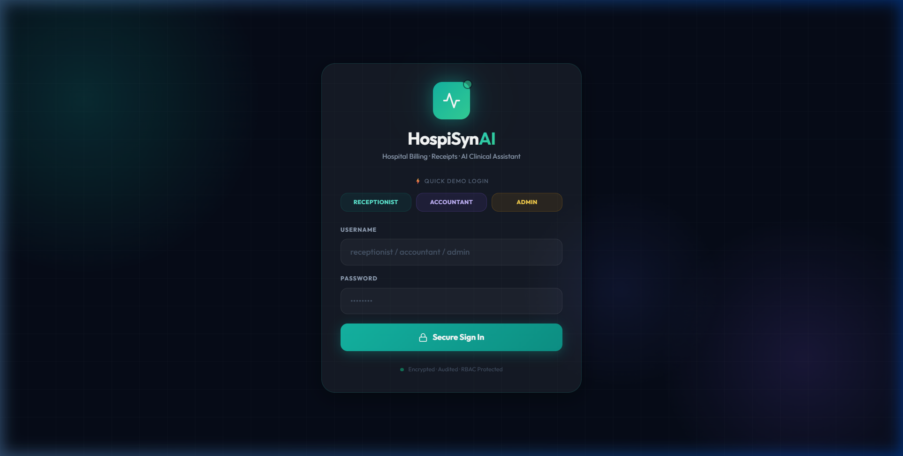

### 📊 2. Main KPI Dashboard & AI Revenue Analyst
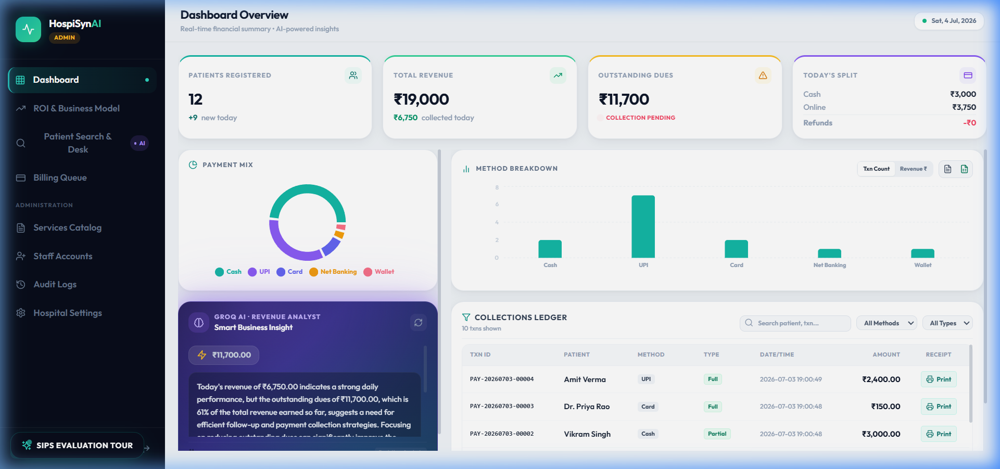

### 🏢 3. Front Desk (Patient Search, Logs & AI Prescription Suggester)
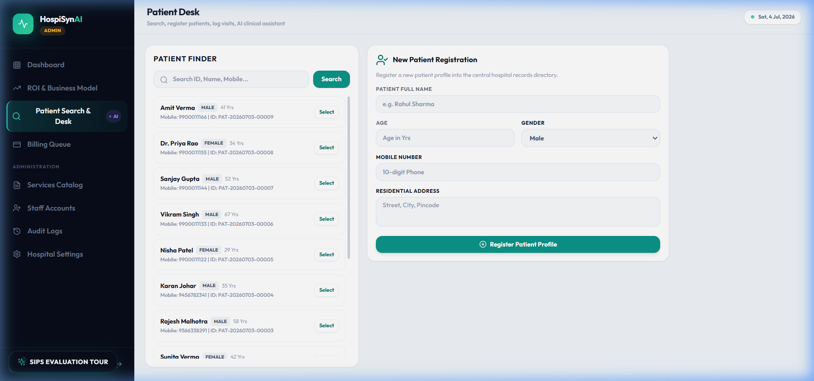

### 💳 4. Financial Operations (Billing Queue & Payment Checkout)
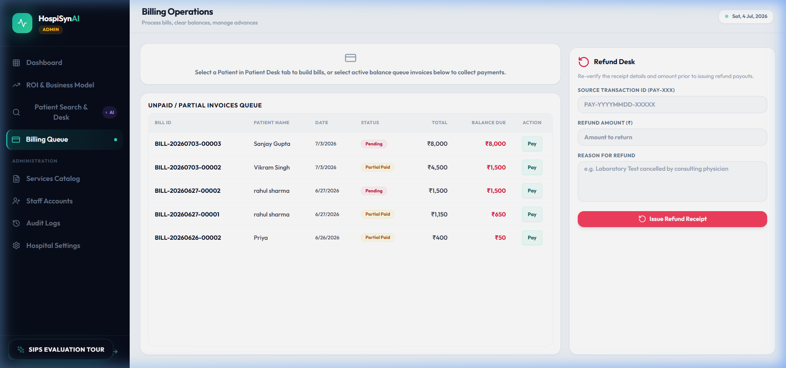

### 📈 5. Return on Investment (ROI) & GST Compliance Calculator
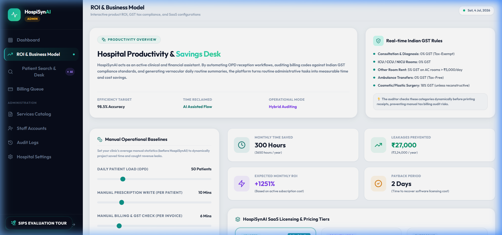

### ⚙️ 6. System Settings & Custom Branding
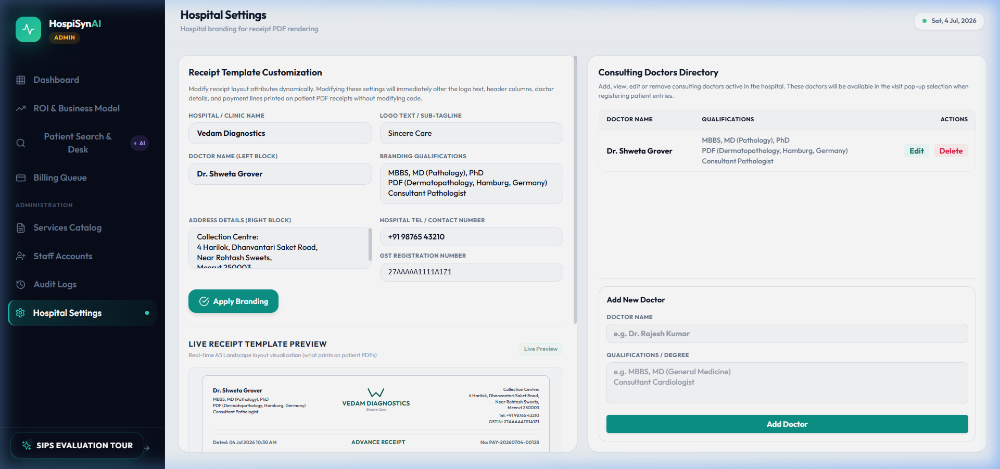

### 📲 7. Mobile-First Patient Portal & QR Check-In Access


---

## 🏗️ Project Architecture

HospiSynAI is built as a decoupled, multi-container system that orchestrates a frontend client, a REST API server, and a relational database.

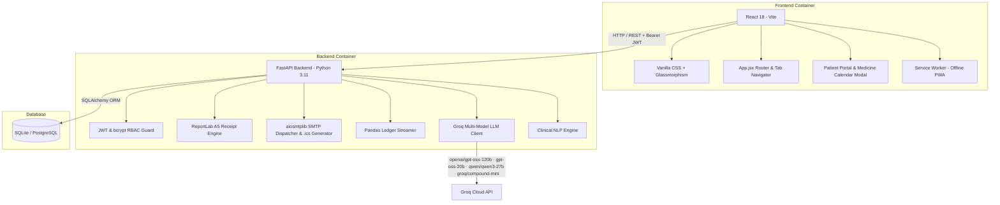
```mermaid
graph TD
    subgraph Frontend Container
        React[React 18 - Vite] --> CSS[Vanilla CSS + Glassmorphism]
        React --> Router[App.jsx Router & Tab Navigator]
        React --> Portal[Patient Portal & Medicine Calendar Modal]
        React --> PWA[Service Worker - Offline PWA]
    end

    subgraph Backend Container
        API[FastAPI Backend - Python 3.11] --> Auth[JWT & bcrypt RBAC Guard]
        API --> PDF[ReportLab A5 Receipt Engine]
        API --> Email[aiosmtplib SMTP Dispatcher & .ics Generator]
        API --> Excel[Pandas Ledger Streamer]
        API --> AI[Groq Multi-Model LLM Client]
        API --> NLP[Clinical NLP Engine]
    end

    subgraph Database
        DB[(SQLite / PostgreSQL)]
    end

    React -->|HTTP / REST + Bearer JWT| API
    API -->|SQLAlchemy ORM| DB
    AI -->|openai/gpt-oss-120b · gpt-oss-20b · qwen/qwen3-27b · groq/compound-mini| Groq[Groq Cloud API]
```

### File Structure
```
HospiSynAI/
├── docker-compose.yml              # Multicontainer orchestration
├── backend/
│   ├── Dockerfile                  # Backend package compilation
│   ├── requirements.txt            # Backend python dependencies
│   ├── database.py                 # Connection pooling & SQLite fallback
│   ├── models.py                   # SQLAlchemy schemas & soft-delete relations
│   ├── schemas.py                  # Pydantic validation boundaries
│   ├── auth.py                     # JWT, Bcrypt & RBAC logic
│   ├── clinical_nlp.py             # Groq LLM & heuristic clinical voice engine
│   ├── nha_cghs_rates.json         # NHA & CGHS government benchmark rates
│   ├── pdf_generator.py            # ReportLab customizable layout PDF engine
│   ├── test_main.py                # Automated Pytest suite for auth & billing
│   └── main.py                     # FastAPI endpoints, exports, seeder & audits
└── frontend/
    ├── Dockerfile                  # Vite React development build
    ├── package.json                # React modules (lucide, recharts)
    ├── vite.config.js              # Port 3000 / 3001 mapping & PWA
    ├── tailwind.config.js          # Modern glassmorphism & typography styling
    ├── index.html                  # Custom fonts & PWA bootloader
    └── src/
        ├── index.css               # Global styling, keyframes & print directives
        ├── main.jsx                # DOM bootstrapping & SW registration
        ├── App.jsx                 # Main dashboard container & router
        ├── hooks/
        │   └── useSpeechRecognition.js  # Web Speech API & audio level visualizer
        ├── utils/
        │   └── clinicalNLPClient.js     # Instant zero-latency client NLP parser
        └── components/             # Modular feature tabs & desks
            ├── LandingPage.jsx             # Public-facing showcase & interactive simulator
            ├── DashboardTab.jsx            # Admin KPI charts & revenue statistics
            ├── DoctorDashboardTab.jsx      # Doctor clinical queue & token counter
            ├── DoctorConsoleTab.jsx        # Doctor clinical desk & Rx generator
            ├── PatientVoiceModal.jsx       # Ambient patient voice intake modal
            ├── VoiceVisualizer.jsx         # Real-time audio waveform visualizer
            ├── ReceptionistDashboardTab.jsx# Receptionist quick desk & token allocator
            ├── AccountantDashboardTab.jsx  # Accountant collections & reconciliation desk
            ├── PatientSearchTab.jsx        # Patient lookup, visits, & AI summary
            ├── BillingTab.jsx              # Invoicing, collections, & refunds
            ├── CatalogTab.jsx              # Medical services & standard pricing
            ├── SettingsTab.jsx             # Branding & ReportLab printed PDF settings
            ├── ROICalculatorTab.jsx        # ROI & financial leakage calculator
            ├── UsersTab.jsx                # User accounts management (RBAC)
            ├── AuditLogsTab.jsx            # Chronological system activity logger
            └── DemoTour.jsx                # Interactive guided feature walkthrough
```

---

## ⚡ Quick Start (Single Command)

### Prerequisites
- Install [Docker Desktop](https://www.docker.com/products/docker-desktop/) (includes Docker Compose).

### Launch the Stack
Clone or navigate to the project directory and execute:

```bash
docker-compose up --build
```

Docker will automatically pull Postgres 15, compile the FastAPI image, pull React node modules, initialize tables, seed base data, and run the services:

- **Frontend Application**: [http://localhost:3000](http://localhost:3000) (with volume-mounted hot-reloading enabled)
- **FastAPI Documentation (Swagger UI)**: [http://localhost:5000/docs](http://localhost:5000/docs)
- **PostgreSQL Database**: Exposing port `5432`

### Local Dev (Without Docker)
```bash
# Backend
cd backend
pip install -r requirements.txt
uvicorn main:app --reload --port 5000

# Frontend (separate terminal)
cd frontend
npm install
npm run dev
```

---

## 🔑 Default Accounts (Development Only)

On first startup, the database is automatically seeded with four accounts representing the core operational hospital roles:

| Username | Password | Role | Panel Permissions |
| :--- | :--- | :--- | :--- |
| **admin** | `admin123` | **Admin** | Complete system access. Audit logs, user administration, catalog pricing, NHA rate configurations, and hospital branding. |
| **doctor** | `doc123` | **Doctor** | Live OPD queue with token numbers, clinical consultation desk, ambient voice intake, AI prescription generator, and diagnostic orders. |
| **receptionist** | `recep123` | **Receptionist** | Front Desk operations. Patient finder/registration, visit queue & token assignment, advance deposit collections, and invoice creator. |
| **accountant** | `acct123` | **Accountant** | Financial desk. Invoice queue payment processing, receipts preview/printing, refund processing, dashboard metrics, and CSV/Excel downloads. |

> [!WARNING]
> These credentials are seeded for development and evaluation purposes. For production deployments, change these passwords immediately.

### Security & Role-Based Access Control (RBAC)

The backend implements JWT token-based authentication and role-based checks using FastAPI dependency injections (specifically `auth.RoleChecker`).

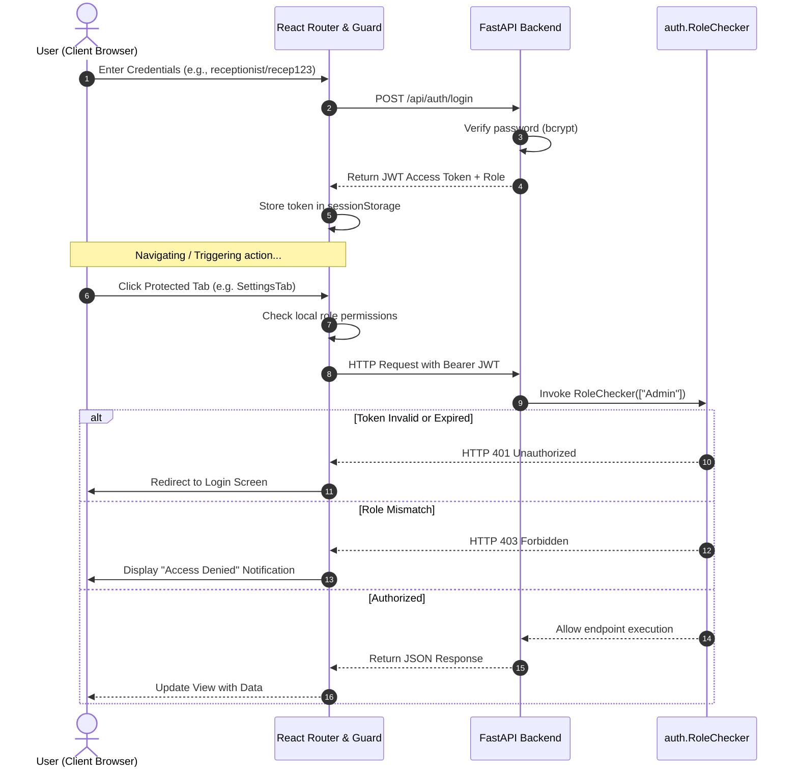
```mermaid
sequenceDiagram
    autonumber
    actor User as User (Client Browser)
    participant React as React Router & Guard
    participant API as FastAPI Backend
    participant Auth as auth.RoleChecker

    User->>React: Enter Credentials (e.g., receptionist/recep123)
    React->>API: POST /api/auth/login
    API->>API: Verify password (bcrypt)
    API-->>React: Return JWT Access Token + Role
    React->>React: Store token in sessionStorage
    
    Note over User, React: Navigating / Triggering action...
    
    User->>React: Click Protected Tab (e.g. SettingsTab)
    React->>React: Check local role permissions
    React->>API: HTTP Request with Bearer JWT
    API->>Auth: Invoke RoleChecker(["Admin"])
    alt Token Invalid or Expired
        Auth-->>React: HTTP 401 Unauthorized
        React->>User: Redirect to Login Screen
    else Role Mismatch
        Auth-->>React: HTTP 403 Forbidden
        React->>User: Display "Access Denied" Notification
    else Authorized
        Auth-->>API: Allow endpoint execution
        API-->>React: Return JSON Response
        React-->>User: Update View with Data
    end
```


| Feature / Workspace | Admin | Doctor | Accountant | Receptionist | Implementation Details |
| :--- | :---: | :---: | :---: | :---: | :--- |
| **User Management** | ✅ | ❌ | ❌ | ❌ | Restricted by `RoleChecker(["Admin"])` |
| **Hospital Branding Settings** | ✅ | ❌ | ❌ | ❌ | Restricted by `RoleChecker(["Admin"])` |
| **Audit Logs** | ✅ | ❌ | ❌ | ❌ | Restricted by `RoleChecker(["Admin"])` |
| **Catalog Price Adjustments** | ✅ | ❌ | ❌ | ❌ | Restricted by `RoleChecker(["Admin"])` |
| **Soft Delete Patients/Bills** | ✅ | ❌ | ❌ | ❌ | Restricted by `RoleChecker(["Admin"])` |
| **Financial KPI Dashboard** | ✅ | ❌ | ✅ | ❌ | Restricted by `RoleChecker(["Admin", "Accountant"])` |
| **Spreadsheet Exports (Excel/CSV)** | ✅ | ❌ | ✅ | ❌ | Restricted by `RoleChecker(["Admin", "Accountant"])` |
| **Invoice Settlements & Refunds** | ✅ | ❌ | ✅ | ❌ | Restricted by `RoleChecker(["Admin", "Accountant"])` |
| **OPD Queue & Clinical Console** | ✅ | ✅ | ❌ | ❌ | Restricted by `RoleChecker(["Admin", "Doctor"])` |
| **AI Prescription & Voice Intake** | ✅ | ✅ | ❌ | ❌ | Restricted by `RoleChecker(["Admin", "Doctor"])` |
| **Patient Registration & Visits** | ✅ | ❌ | ❌ | ✅ | Restricted by `RoleChecker(["Admin", "Receptionist"])` |
| **Billing Builder (Bill Queue)** | ✅ | ❌ | ❌ | ✅ | Restricted by `RoleChecker(["Admin", "Receptionist"])` |

---

## 🛠️ Relational Database Schema Design

The database is fully normalized and handles cascading deletions, soft-delete statuses, dynamic branding parameters, and audit trails. Supports both SQLite (local dev) and PostgreSQL (Docker/production).

### Entity Relationship Diagram (ERD)

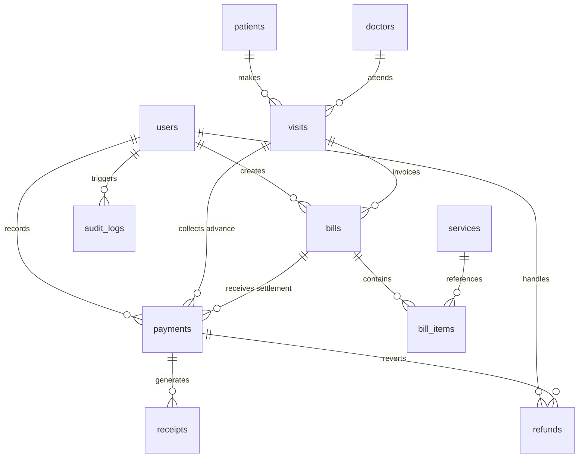
```mermaid
erDiagram
    users ||--o{ bills : "creates"
    users ||--o{ payments : "records"
    users ||--o{ refunds : "handles"
    users ||--o{ audit_logs : "triggers"
    patients ||--o{ visits : "makes"
    doctors ||--o{ visits : "attends"
    visits ||--o{ bills : "invoices"
    visits ||--o{ payments : "collects advance"
    bills ||--o{ bill_items : "contains"
    bills ||--o{ payments : "receives settlement"
    payments ||--o{ receipts : "generates"
    payments ||--o{ refunds : "reverts"
    services ||--o{ bill_items : "references"
```

### Table Schema Definitions

1. `users`: Staff authentication credentials (bcrypt-hashed) and role configurations.
2. `patients`: Core profile table (`patient_id` matches format `PAT-YYYYMMDD-XXXXX`). Contains `is_active` soft-delete index.
3. `doctors`: Medical practitioners' information (name, qualifications).
4. `visits`: Patient entries (`visit_id` formatted `VIS-YYYYMMDD-XXXXX`). Contains symptoms, diagnosis, prescription details, and **`token_number`** (persistent OPD queue token).
5. `services`: Price book representing standard hospital rates (OPD registration, ICU bed rent, MRIs, etc.).
6. `bills`: Financial invoice records (`bill_id` formatted `BILL-YYYYMMDD-XXXXX`) detailing total billed amounts, applied visit advances, remaining outstanding balances, and payment statuses (`Pending`, `Partial Paid`, `Paid`).
7. `bill_items`: Individual invoice lines referencing standard service IDs, capturing price snapshot at billing.
8. `payments`: Transaction logs (`payment_id` formatted `PAY-YYYYMMDD-XXXXX`). Links to visit for advance deposits or bill for invoice payments. Stores method (Cash, UPI, etc.), reference notes, and type.
9. `receipts`: Connects completed payments to generated PDFs (`receipt_id` formatted `REC-YYYYMMDD-XXXXX`).
10. `refunds`: Outflow tracking table (`refund_id` formatted `REF-YYYYMMDD-XXXXX`) mapping adjustments back to the original transaction.
11. `settings`: Key-value configuration dictionary storing logo headers, doctor names, addresses, contacts, and tax info.
12. `audit_logs`: Chronological log entries mapping actions to user sessions.

---

## 🤖 AI Model Configuration

HospiSynAI uses a **multi-model cascade** via the Groq Cloud API. The system tries models in priority order and falls back automatically if one is unavailable:

| Priority | Model | Use Case |
| :---: | :--- | :--- |
| 1 | `openai/gpt-oss-120b` | Primary: prescription suggestions, billing audits, handouts |
| 2 | `openai/gpt-oss-20b` | Fallback: faster inference, lighter tasks |
| 3 | `qwen/qwen3-27b` | Fallback: multilingual handout generation |
| 4 | `groq/compound-mini` | Final fallback: low-latency JSON extraction |

The `GROQ_MODEL` environment variable sets the primary model. The `clinical_nlp.py` engine independently cycles through the same cascade for voice intake parsing.

---

## 📊 Verification Flow Walkthrough

Follow this standard workflow to verify system capabilities:

### Step 1: Front Desk (Receptionist)
1. Log in to [http://localhost:3000](http://localhost:3000) using `receptionist` / `recep123`.
2. Navigate to **Patient Search & Desk**.
3. Fill out the **New Registration** form to register a new patient profile. Check that a unique sequential Patient ID is generated (e.g. `PAT-20260626-00001`).
4. Select the registered patient. Fill out the **Record Patient Visit** input to start a consultation (e.g., inputting "Fever and Dry Cough" as symptoms). Check that a Visit ID and **OPD Token Number** are generated.
5. Click the **Clinical Notes & AI Summary** button on the active visit to open the consultation workspace modal:
   - In the chief complaints field, write or select symptoms (e.g., "Fever and Dry Cough").
   - Click the **🧠 AI Suggest Treatment** button. The system will leverage the Groq LLM cascade to instantly generate standard clinical prescriptions (diagnosis, medicines with dosages, diagnostic tests, advice, follow-up schedule) compliant with clinical dosing rules.
   - Review and customize the AI-suggested fields as needed.
   - Click **Generate AI Summary** to trigger the Groq LLM API. Verify that a simplified, bilingual (English + Hindi) explanation is populated showing structured routines.
   - Click **Save Summary** to store it, and **Print Summary** or **Download PDF** to retrieve the ReportLab-generated prescription sheet.

### Step 2: Doctor (OPD Queue)
1. Log in as `doctor` / `doc123`.
2. View the **Doctor Dashboard** — verify the live OPD queue showing all today's patients with their persistent token numbers, sorted chronologically (earliest tokens first).
3. Check the **waiting vs. completed** patient count cards.
4. Click into the **Doctor Console** for a specific patient:
   - Click the **🎙️ Voice Intake** button to open the Ambient Voice Intake modal. Speak a chief complaint — watch the real-time waveform visualizer and confirm the AI returns a structured clinical JSON (complaints, likely diagnoses, suggested tests).
   - Use **🧠 AI Suggest Treatment** for an instant prescription recommendation.
   - Fill diagnosis, medicines, and advice fields; save the consultation.
   - Generate the multilingual patient handout and switch between all 11 Indian languages from the dropdown.
6. In the visit module, record an **Advance Deposit** of `500` via `UPI` (Reference: `TXN987654`).
7. Build an invoice using the **Multi-Item Bill Creator**:
   - To find appropriate tests for the patient's symptoms, click **✨ AI Test Suggester**. The system queries the active services database catalog and returns recommendations with reasons based on the patient's age, gender, and symptoms.
   - Click **Add to Bill** to select a recommended test (e.g. Complete Blood Count (CBC) - standard ₹350, and Chest X-Ray PA View - standard ₹450).
   - Before generating the invoice, click **Run AI Audit** under the **AI Billing Auditor** section. The audit scans line items for duplicates, excessive charges, missing consultation codes, clinical mismatches, or age anomalies, returning a `clear`, `warning`, or `critical` verdict.
   - Click **Generate Invoice** after verifying the audit.
8. Check that the system automatically applies the `500` advance payment to the `800` grand total, setting the bill status to `Partial Paid` with a remaining balance of `300`.

### Step 3: Financial Desk (Accountant)
1. Log in as `accountant` / `acct123`.
2. Verify the **AI Dashboard Revenue Insights** card displayed at the top of the Dashboard. It dynamically parses today's financials (revenue, visits, online/cash splits, outstanding dues) to present an administrative summary, data highlight, actionable recommendation, and sentiment color indicator.
3. Go to **Billing Queue**. Locate the outstanding invoice generated in the previous step.
4. Click **Pay**, choose `UPI`, and enter `300` as the collection amount.
5. Click **Process Payment**. Check that the invoice status immediately shifts to `Paid` and a receipt modal opens.
6. In the receipt modal:
   - Click **Save PDF** to download the high-quality ReportLab PDF generated by the backend.
   - Click **Print Receipt** to verify formatting.
7. Issue a refund: Copy the **full Payment ID** (starts with `PAY-`) directly from the Patient Desk (which displays full Payment IDs with a one-click copy button next to receipts), the Receipt modal, or the Billing Workspace's transaction log. Paste it into the **Refund Desk** on the right, input a refund amount (e.g., `100` for test cancellation), and click **Issue Refund Receipt**. Check that the invoice balance returns to `100` and a Refund Receipt is logged.
8. Run spreadsheet reports by clicking **CSV Report** or **Excel Report** at the top of the dashboard.

### Step 4: Administration (Admin)
1. Log in as `admin` / `admin123`.
2. Go to **Hospital Settings**. Edit the branding fields (e.g. change the Doctor Name or Hospital Logo/Title).
3. Open any receipt. Check that the printed/displayed PDF headers update dynamically.
4. Check the **System Audit Trail** tab. Verify that all patient registrations, visit additions, payments, settings modifications, and user logins are logged with their corresponding timestamp and user session.

### Step 5: Patient Self-Service & Medicine Calendar (Patient Portal)
1. Navigate to the **Patient Portal** tab from the top navigation, or scan the Hospital QR Code (`screenshots/qr-code.png`) with a smartphone.
2. Enter the Patient ID (e.g., `PAT-20260626-00001`) or phone number to authenticate instantly.
3. In the Patient Portal workspace:
   - View your **Digital Health Card** with real-time QR pass and patient demographic summary.
   - Inspect active and past consultations, diagnoses, and prescribed medicines.
   - Click **Download Prescription** or **Download Invoice** to retrieve the official bilingual ReportLab A5 PDF.
4. Click **Set Reminders for Medicines & Timetable**:
   - The **Medicine Calendar Modal** automatically categorizes medicines into Morning, Afternoon, Evening, and Night slots.
   - Click **Save to Google Calendar** to trigger pre-configured recurring alarms directly on Google Calendar.
   - Click **Download .ics File** to save universal calendar event reminders to Apple Calendar, Outlook, or device alarms.
5. Click **Email Summary** to test asynchronous background email delivery (attaching the A5 PDF and `.ics` calendar invitation).

### Step 6: Automated Testing (Verification)
Verify backend routing logic and clinical/GST billing rules using the automated test suite:
1. Open a terminal in the project root directory.
2. Run pytest inside the backend environment:
   ```bash
   python -m pytest backend/test_main.py
   ```
3. Check that all 21 unit tests pass, confirming correctness of password hashing, JWT token generation, RBAC security restrictions, duplicate test auditing, room rent & cosmetic surgery GST calculations, missing consultation fee alerts, pediatric dosage safety flags, and AI response schema structures.

---

## 🔒 Security & Configuration / Deployment Notes

For deployment and local setup, the project supports a `.env` configuration file. A `.env.example` has been provided at the project root to guide configuration.

### ⚙️ Environment Variables Reference

| Variable Name | Description | Default Value |
| :--- | :--- | :--- |
| `POSTGRES_DB` | PostgreSQL database name | `hospisyn` |
| `POSTGRES_USER` | PostgreSQL admin username | `postgres` |
| `POSTGRES_PASSWORD` | PostgreSQL admin password | `postgrespassword` |
| `POSTGRES_PORT` | Port exposed by PostgreSQL container | `5432` |
| `DATABASE_URL` | SQLAlchemy connection string | `postgresql://postgres:postgrespassword@db:5432/hospisyn` |
| `JWT_SECRET` | Secret key for signing authorization tokens | `supersecretgooglesde3hospitalbillingsystemkey12345` |
| `JWT_ALGORITHM` | Algorithm used for JWT signatures | `HS256` |
| `ACCESS_TOKEN_EXPIRE_MINUTES`| Expiration lifetime of access tokens | `480` |
| `BACKEND_PORT` | Port mapped to FastAPI backend | `5000` |
| `FRONTEND_PORT` | Port mapped to React frontend | `3000` |
| `VITE_API_BASE_URL` | API Base URL used by the React client | `http://localhost:5000/api` |
| `VITE_STATIC_BASE_URL` | Static download Base URL (for PDF receipts) | `http://localhost:5000` |
| `GROQ_API_KEY` | API Key for Groq Cloud services (required for AI features) | *(None)* |
| `GROQ_MODEL` | Primary Groq LLM model | `openai/gpt-oss-120b` |
| `SMTP_HOST` | SMTP server host for sending transaction emails | *(Optional, e.g. `smtp.gmail.com`)* |
| `SMTP_PORT` | SMTP server port | `587` |
| `SMTP_USER` | SMTP authentication username / sender email | *(Optional)* |
| `SMTP_PASSWORD` | SMTP authentication password / App password | *(Optional)* |
| `SMTP_FROM_EMAIL` | Displayed sender email address | `noreply@hospisynai.internal` |

### 🚀 Production Deployment Checklist

1. **Passwords**: Change the default credentials seeded by `backend/main.py`.
2. **Secrets**: Generate a secure, cryptographically random string for `JWT_SECRET` in your `.env` file.
3. **Exposed Ports**: Customize `BACKEND_PORT` and `FRONTEND_PORT` if there are conflicts on the host system.
4. **SSL/TLS & Domain**: Update `VITE_API_BASE_URL` and `VITE_STATIC_BASE_URL` to your production domain (using `https`) and host backend/frontend behind an Nginx reverse proxy.
5. **Backup Plan**: Create automated cron jobs to backup the `pgdata` volume (PostgreSQL state) and `receipts_data` volume (generated receipt files).

---

## 🏥 HospiSynAI for Tier 2 & Tier 3 Hospitals — How We Compare

> Tier 2 and Tier 3 hospitals in India — district hospitals, nursing homes, standalone OPD clinics, and small multi-speciality setups — typically run on basic billing software, desktop ERP tools, or even paper registers. AI features, if any, are locked behind expensive enterprise tiers they can't afford. **HospiSynAI brings hospital-grade AI to exactly this segment, at zero licensing cost.**

| Capability | 🏚️ Typical Tier 2 / Tier 3 HMS | 🚀 HospiSynAI |
| :--- | :---: | :---: |
| **AI Prescription Suggester** (LLM generates diagnosis + medicines + tests from symptoms) | ❌ Not available | ✅ Built-in, no extra cost |
| **Persistent OPD Token System** (token numbers survive refresh, ordered queue) | ❌ Manual slip / paper | ✅ Database-backed, auto-assigned |
| **Role-Specific Dashboards** (Doctor queue, Receptionist desk, Accountant ledger, Patient Portal) | ❌ Single generic view | ✅ 5 tailored workspaces |
| **Patient Self-Service Portal** (Digital UHID pass, prescriptions & invoices access) | ❌ Absent / Paper slips | ✅ Built-in Web & QR Portal |
| **Medicine Calendar & Timetable Reminders** (Google Calendar / Apple `.ics` sync) | ❌ Confusing handwriting on slips | ✅ 1-click sync to phone calendar with daily alarms |
| **Automated Email Invoicing & Invites** (Async SMTP delivery with PDF & `.ics`) | ❌ Manual printout only | ✅ Automated async HTML emails with attachments |
| **Pre-Invoice Billing Fraud Auditor** (catches duplicate tests, age errors, clinical mismatches before checkout) | ❌ Not available | ✅ Runs automatically before every invoice |
| **Patient Handout in Regional Language** (Kannada, Tamil, Telugu, Hindi, Bengali etc.) | ❌ English only or fixed Hindi printout | ✅ 11 live Indian languages, auto-generated by AI |
| **AI-Driven Dashboard Insights** (narrative analysis of revenue, sentiment, recommendations) | ❌ Static counters / bar charts only | ✅ AI writes a paragraph summary of today's financial health |
| **AI Test & Service Recommender** (suggests relevant OPD tests from hospital's own catalog) | ❌ Staff manually checks catalog | ✅ AI recommends with clinical reasoning |
| **Ambient Voice Intake** (patient speaks in Hindi/Hinglish, AI extracts clinical data) | ❌ Not available | ✅ Real-time waveform + Groq multi-model AI |
| **Customisable PDF Receipts & Prescriptions** | ❌ Fixed vendor template, needs IT support to change | ✅ Admin panel — edit hospital name, logo, GSTIN, doctor in 30 seconds |
| **Advance → Invoice Auto-Adjustment** | ❌ Manual calculation by staff | ✅ Advance automatically detected and deducted from invoice total |
| **Refund Processing with Receipt** | ❌ Manual ledger entry | ✅ Structured refund desk, PDF receipt generated automatically |
| **Role-Based Access Control** (Doctor / Receptionist / Accountant / Admin scoped separately) | ❌ Single login or basic admin/user split | ✅ Fine-grained per-endpoint enforcement via JWT + FastAPI |
| **Immutable Audit Trail** | ❌ Absent or easily editable | ✅ Every action logged with user + timestamp, Admin-only read |
| **Excel / CSV Export** | ❌ Manual report printing or absent | ✅ One-click server-side streaming export |
| **Setup & Deployment** | ❌ Vendor installation visit, days of setup | ✅ `docker-compose up --build` — running in under 60 seconds |
| **Licensing Cost** | ❌ Monthly per-bed / per-user SaaS fee | ✅ Completely free — open-source, self-hosted |
| **Open Source / Auditable** | ❌ Closed black-box software | ✅ Every line of code is open and auditable |

> [!TIP]
> For a Tier 2 or Tier 3 hospital with 5–50 beds, HospiSynAI replaces the billing counter software, the OPD token counter, the prescription notepad, and the revenue spreadsheet — all in one system — while adding AI assistance that was previously only available to large corporate hospital chains paying for enterprise HMS subscriptions.

